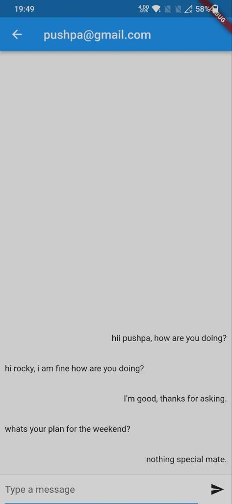
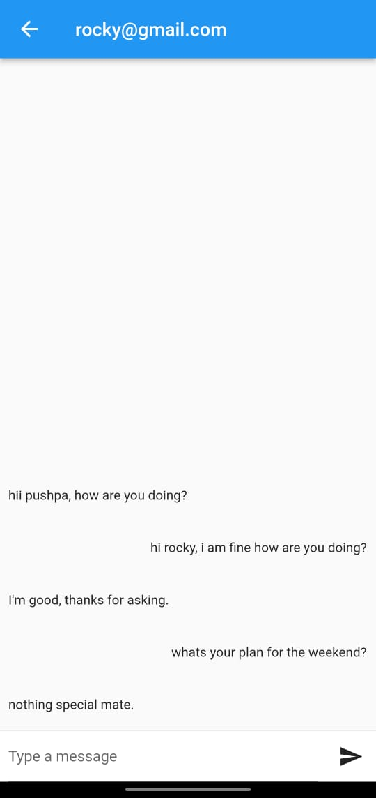

# Chat Application with RSA Encryption and Steganography

This is a Flutter-based chat application that uses RSA encryption and Steganography to secure messages sent between two users. The messages are first encrypted with the recipient's public key before being sent, ensuring that only the recipient can read the message. The app also uses steganography to encode the encrypted message into an image, which is then sent over the network. The app integrates with Firebase Firestore to store the chat messages details, and Firebase Storage to store the encrypted images.

# Table of Contents

- Installation
- Usage
- features
- Contributors
- License

## Installation

1. Clone the repository: `git clone https://github.com/Sunil-Meka/AC-final-project.git`
2. Install dependencies: `flutter pub get`
3. Launch the app: `flutter run`

## Usage

1. Create a new user account by signing up with your email and password.
2. Log in to the app with your account credentials.
3. Start a new chat by selecting a user from your contacts list.
4. Type a message and press send. The message will be encrypted and hidden in an image before being sent to the recipient.
   - the encoded image will be saved in the firebase storage.
   - the uploaded image url will be saved in the firebase firestore record along with sender and receiver details.
   - Receiver will receive the new message in chat screen as an firestore record which then using the image url the cipher text is extracted using steganography and then using the RSA private key the cipher text is decoded to original message.
   - The same process is repeated for sender sent messages where the message is encrpted using sender public key this time, this is for sender viewing the sent messages in chat history.
5. View your chat history by selecting a user from the list of active chats.

## Features

- Secure messaging with RSA encryption and Steganography
- Messages are encrypted using RSA and then the cipher text is encoded in Image using steganography
- Integration with Firebase Authentication, Firebase Firestore and Firebase Storage
- User registration with email and password
- User authentication with email and password

## Contributors

We would like to thank the following contributors for their valuable contributions to this project:

- Vijaya Sunil Meka(@Sunil-Meka): Functionalities of the Application
- prasad (@janedoe): User Interface of the application
- Sundeep Reddy Nallamilli(@just-breathing): Debugging and Testing of the Application

## License

This project is licensed under the [MIT License](LICENSE).

# Output Screenshots:

Login Screen:

Register Screen:

Users Screen:

Chat Screen of User 1:

Chat Screen of User 2:

